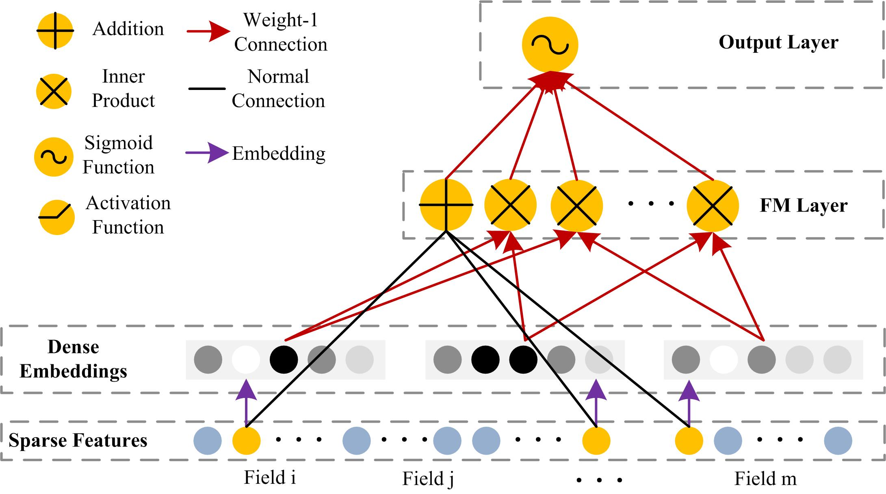
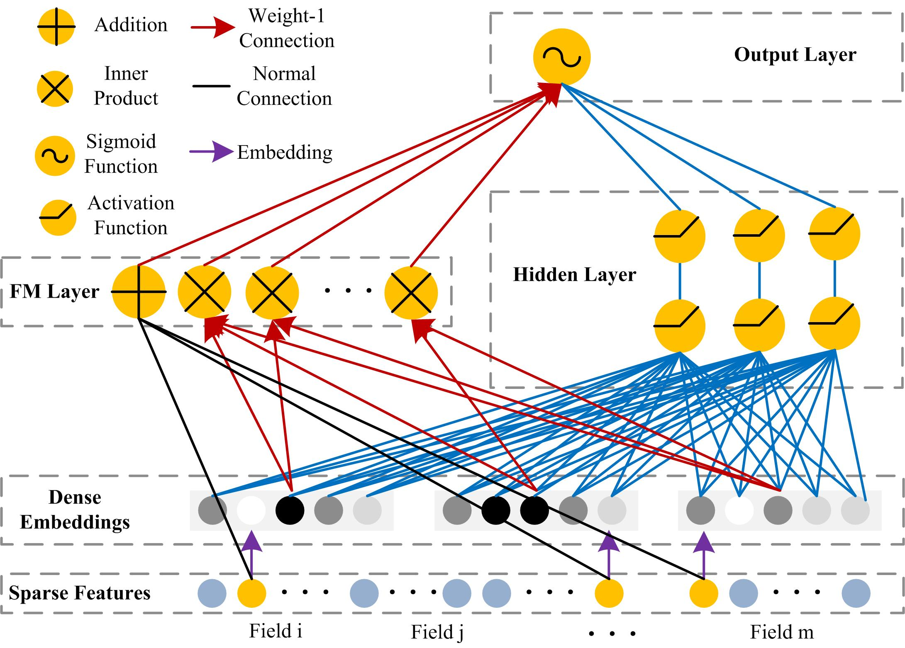
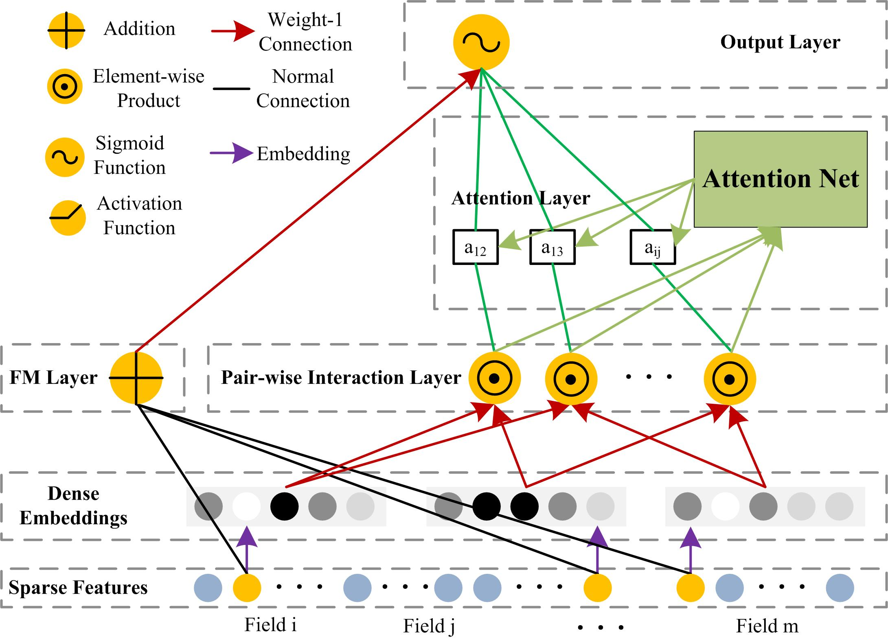
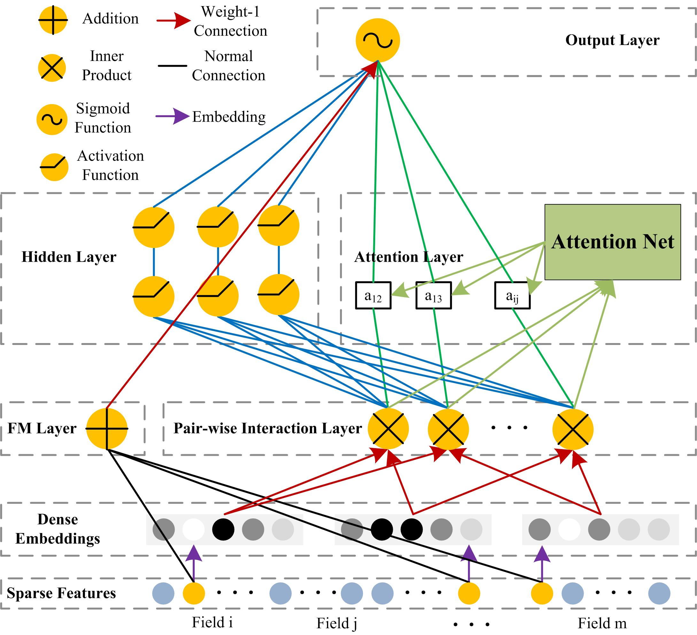

## 1. Characteristics of the dataset
Item | Values 
 :- | :-
umber of Mashups | 6206
Number of APIs | 12919
Number of invocations | 13107
Average number of invocations per Mashup | 2.11
Number of called APIs | 940
Called proportion of APIs | 7.28%
Number of interactions |  9297
Number of labeled Mashup tags | 18601
Number of Mashup tags | 403
Number of labeled API tags | 44891
Number of API tags | 473
Average length of Mashup description | 27.63
Average length of API description | 68.98
Number of Mashups with included APIs | 5341
Sparsity of Mashup-API matrix | 99.81%
Number of categories | 427
Number of sub-categories | 12503

Run programme [dataset_characteristics.py](dataset_characteristics.py) to generate the above statistical data.

## 2. Integrating FM Model with Deep Learning Models
Model | Reference | Code 
 :- | :- | :-
**basicFM** | [S. Rendle, “Factorization Machines,” 2010 IEEE International Conference on Data Mining, 2010, pp. 995-1000.](references/2010_ICDM_Factorization_Machines.pdf) | [code](https://github.com/hexiangnan/attentional_factorization_machine)
**FNN** | [W. Zhang, T. Du, and J. Wang, “Deep learning over multi-field categorical data,” European conference on information retrieval, 2016, pp. 45-57.](references/2016_ECIR_Deep_Learning_over_Multi-field_Categorical_Data_A_Case_Study_on_User_Response_Prediction.pdf) | [code](https://github.com/shenweichen/DeepCTR)
**Wide&Deep** | [H.-T. Cheng, L. Koc, J. Harmsen, T. Shaked, T. Chandra, H. Aradhye, G. Anderson, G. Corrado, W. Chai, and M. Ispir, “Wide & deep learning for recommender systems,” the 1st workshop on deep learning for recommender systems, 2016, pp. 7-10.](references/2016_DLRS_Wide_&_Deep_Learning_for_Recommender_Systems.pdf) | [code](https://github.com/shenweichen/DeepCTR)
**Deep&Cross** | [Y. Shan, T. R. Hoens, J. Jiao, H. Wang, D. Yu, and J. Mao, “Deep crossing: Web-scale modeling without manually crafted combinatorial features,” the 22nd ACM SIGKDD international conference on knowledge discovery and data mining, 2016, pp. 255-262.](references/2016_KDD_Deep_crossing_Web-scale_modeling_without_manually_crafted_combinatorial_features.pdf) | [code](https://github.com/shenweichen/DeepCTR)
**DeepFM** |  [H. Guo, R. Tang, Y. Ye, Z. Li, and X. He, “DeepFM: A Factorization-Machine based Neural Network for CTR Prediction,” International Joint Conference on Artificial Intelligence, 2017, pp. 1725-1731.](references/2017_IJCAI_DeepFM_a_factorization-machine_based_neural_network_for_CTR_prediction.pdf) | [code](https://github.com/shenweichen/DeepCTR)
**NFM** | [X. He, and T.-S. Chua, “Neural factorization machines for sparse predictive analytics,” International ACM SIGIR conference on Research and Development in Information Retrieval, 2017, pp. 355-364.](references/2017_SIGIR_Neural_Factorization_Machines_for_Sparse_Predictive_Analytics.pdf) | [code](https://github.com/hexiangnan/neural_factorization_machine)
**AFM** | [J. Xiao, H. Ye, X. He, H. Zhang, F. Wu, and T.-S. Chua, “Attentional Factorization Machines: Learning the Weight of Feature Interactions via Attention Networks,” International Joint Conference on Artificial Intelligence, 2017, pp. 3119-3125.](references/2017_IJCAI_Attentional_factorization_machines_Learning_the_weight_of_feature_interactions_via_attention_networks.pdf) | [code](https://github.com/hexiangnan/attentional_factorization_machine)

## 3. FM Model based Applications for Web API Recommendation
* **basicFM**
  * B. Cao, B. Li, J. Liu, M. Tang, and Y. Liu, “Web APIs Recommendation for Mashup Development based on Hierarchical Dirichlet Process and Factorization Machines,” International Conference on Collaborative Computing: Networking, Applications and Worksharing, 2016, pp. 3-15.
  * M. M. Rahman, X. Liu, and B. Cao, “Web API Recommendation for Mashup Development Using Matrix Factorization on Integrated Content and Network-based Service Clustering,” 2017 IEEE International Conference on Services Computing (SCC), 2017, pp. 225-232.
  * B. Cao, B. Li, J. Liu, M. Tang, Y. Liu, and Y. Li, “Mobile Service Recommendation via Combining Enhanced Hierarchical Dirichlet Process and Factorization Machines,” Mobile Information Systems, vol. 2019, 2019.

* **DeepFM**
  * X. Zhang, J. Liu, B. Cao, Q. Xiao, and Y. Wen, “Web Service Recommendation via Combining Doc2Vec-based Functionality Clustering and DeepFM-Based Score Prediction,” 2018 IEEE Intl Conf on Parallel & Distributed Processing with Applications, Ubiquitous Computing & Communications, Big Data & Cloud Computing, Social Computing & Networking, Sustainable Computing & Communications, 2018, pp. 509-516.

* **AFM**: 
  * Y. Cao, J. Liu, M. Shi, B. Cao, T. Chen, and Y. Wen, “Service Recommendation Based on Attentional Factorization Machine,” International Conference on Services Computing, Year, pp. 189-196.

## 4. NAFM: Neural and Attentional Factorization Machine for Web API Recommendation
### 4.1 Motivation
The state-of-the-art models for Web API recommendation, they either model factorized interactions with the same weight or neglect the the non-linear and complex inherent structure of real-world data. In real-world applications, different predictor variables usually have different predictive power, and not all features contain useful signal for estimating the target. Moreover, complex and non-linear structure are usually underlied in real-world data. Therefore, we propose a hybrid factorization machine model with a novel neural network architecture named NAFM by integrating neural network (i.e., neural component) to capture the non-linear feature interactions and attention network (i.e., attention component) to capture the different importance of feature interactions. [code](nafm.py)
### 4.2 Data preprocessing
* Step1: Train Doc2Vec model with all Mashup and API description information, and selected 100 most popular APIs and the associated 1993 Mashups as our experimental data
  * Code: <get_samples.py>
  * Input: [the raw dataset](dataset)
  * Output: doc2vec.model, samples.pickle
* Step2: Process the experimental data and transform them into input data for models
  * Code: <get_input_data.py>
  * Input: doc2vec.model, samples.pickle
  * Output: <input_data.csv>
 * Step3: Split the input data into two parts with 80% trainging data and 20% testing data
  * Code: <process_input_data.py>
  * Input: <input_data.csv>
  * Output: input_data.pickle
* Step3: Parameter optimization
  * Code: <parameter_optimization.py>
  * Input: input_data.pickle
  * Output: print the defaulf best parameter values
### 4.3 Evaluation
* Performance comparison
  * Code: <run_input_data.py>
  * Input: <input_data.csv>
  * Output: <evaluation_results.csv>
* Impact of parameters
  * Code:
  * Input: 
  * Output: 

## 5. Neural Network Architechtures and Comparison for FM based Models in Web API Recommendation
### 5.1 Neural network architechtures for FM based Models in Web API recommendation
Models | Architechtures 
 :- | :-:
**basicFM** | 
**DeepFM** | 
**AFM** | 
**NAFM** | 

### 5.2 Comparison of FM based models for Web API recommendation
| Model | Order-1 Features  | Order-2 Features  | High-order Feature Interactions  | Discriminate the Importance of Order-2 Feature Interactions  | High-order Input  |
| :-- | :--: | :--: | :--: | :--: | :--: |
| **basicFM**  | √  | √  | ×  | ×  | None  |
| **DeepFM**  | √  | √  | √  | ×  | Embedding Vectors  |
| **AFM**  | √  | √  | ×  | √  | Order-2 Feature Interactions  |
| **NAFM**  | √  | √  | √  | √ | Order-2 Feature Interactions  |

