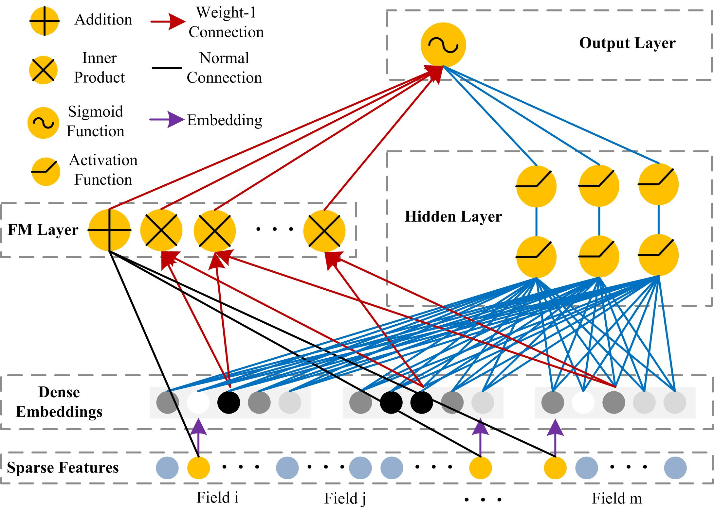
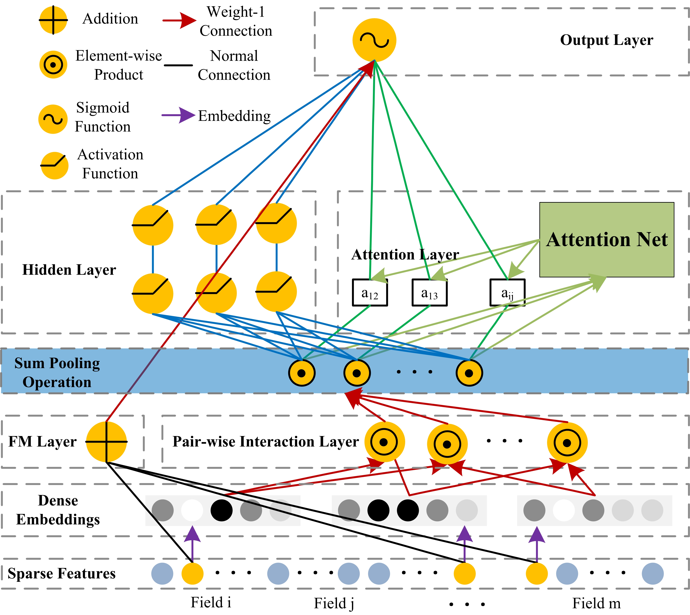

## 1. Characteristics of the dataset
Item | Values 
 :- | :-
umber of Mashups | 6206
Number of APIs | 12919
Number of invocations | 13107
Average number of invocations per Mashup | 2.11
Number of called APIs | 940
Called proportion of APIs | 7.28%
NUmber of interactions |  9297
Number of labeled Mashup tags | 18601
Number of Mashup tags | 403
Number of labeled API tags | 44891
Number of API tags | 473
Average length of Mashup description | 27.63
Average length of API description | 68.98
Sparsity of Mashup-API matrix | 99.84%

Run programme [dataset_characteristics.py](dataset_characteristics.py) to generate the above statistical data.

## 2. FM (Factorization Machines) based Models for Service (Web API) Recommendation
### basicFM
[S. Rendle, “Factorization Machines,” 2010 IEEE International Conference on Data Mining, 2010, pp. 995-1000.](references/2010_ICDM_Factorization_Machines.pdf)

### DeepFM
[H. Guo, R. Tang, Y. Ye, Z. Li, and X. He, “DeepFM: A Factorization-Machine based Neural Network for CTR Prediction,” International Joint Conference on Artificial Intelligence, 2017, pp. 1725-1731.](references/2017_IJCAI_DeepFM_a_factorization-machine_based_neural_network_for_CTR_prediction.pdf)
 

### AFM
[J. Xiao, H. Ye, X. He, H. Zhang, F. Wu, and T.-S. Chua, “Attentional Factorization Machines: Learning the Weight of Feature Interactions via Attention Networks,” International Joint Conference on Artificial Intelligence, 2017, pp. 3119-3125.](references/2017_IJCAI_Attentional_factorization_machines_Learning_the_weight_of_feature_interactions_via_attention_networks.pdf)

## 2. NAFM: Neural and Attentional Factorization Machine for Service (Web API) Recommendation

